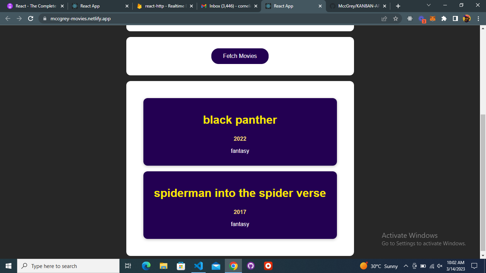

## About web-app

This is an SPA that allows you create a movie description input, saves that input in the backend and also allows you fetch those saved movies from the backend.

## Table of contents

- [Overview](#overview)
  - [The challenge](#the-challenge)
  - [Links](#links)
  - [Built with](#built-with)
  - [What I learned](#what-i-learned)
- [Author](#author)

## Overview

### The challenge

Users should be able to:

- View the optimal layout for the app depending on their device's screen size
- See hover states for all interactive elements on the page
- Send post request
- Add movies from backend

### Links

- Live Site URL: [MccGrey-movies](https://mccgrey-movies.netlify.app/)

### Built with

- Semantic HTML5 markup
- CSS custom properties
- [React](https://reactjs.org/) - JS library
- Firebase

### What I learned

I mainly learnt how to send a request to a backend, use async / await, useEffect for requests, and send POST request

## Author

### AGUONYE CORNELIUS (MCCGREY)

- LinkedIn - [@mccgrey](https://www.linkedin.com/in/mccgrey)
- Twitter - [@browncheese6](https://www.twitter.com/browncheese6)
- Github - [@MccGrey](https://github.com/MccGrey)
